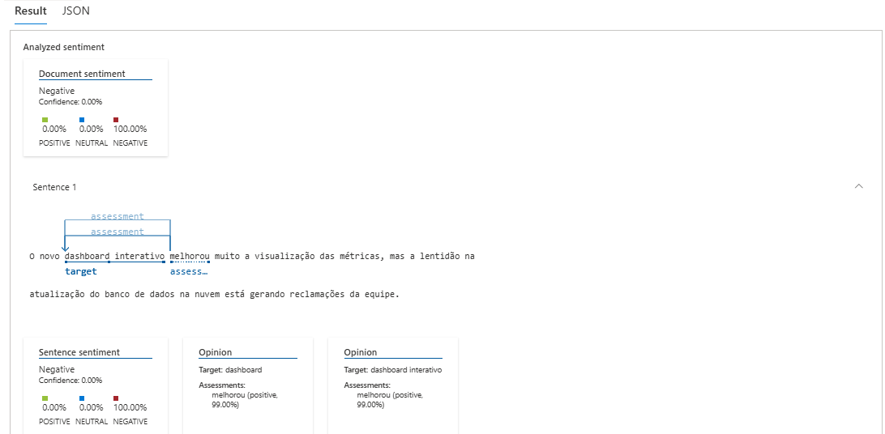
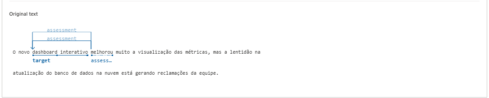
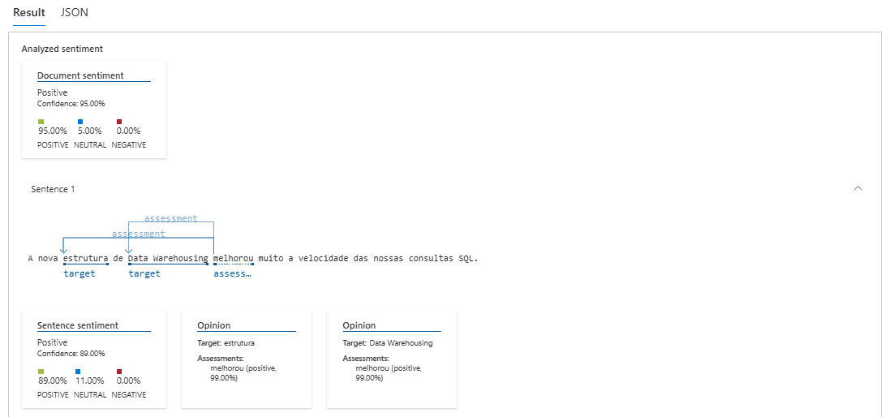
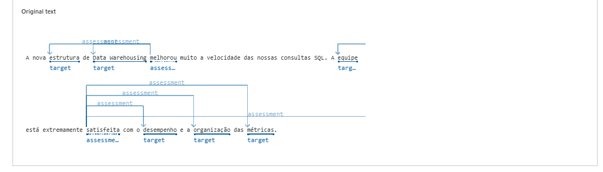
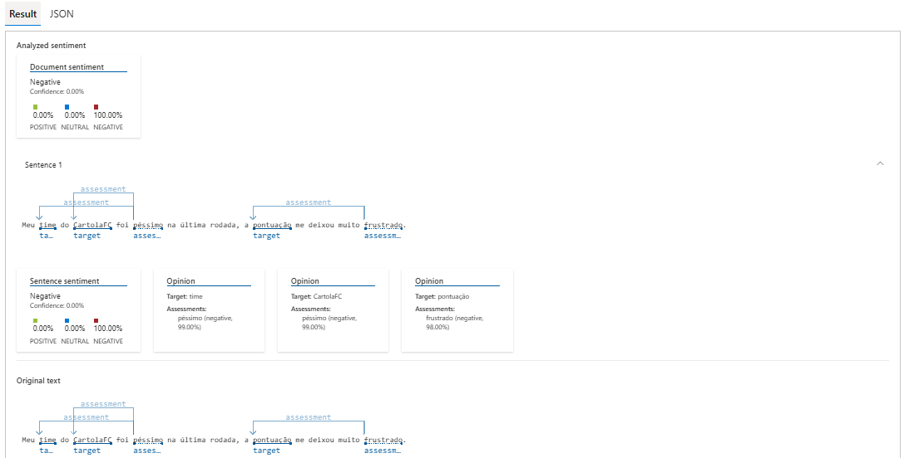
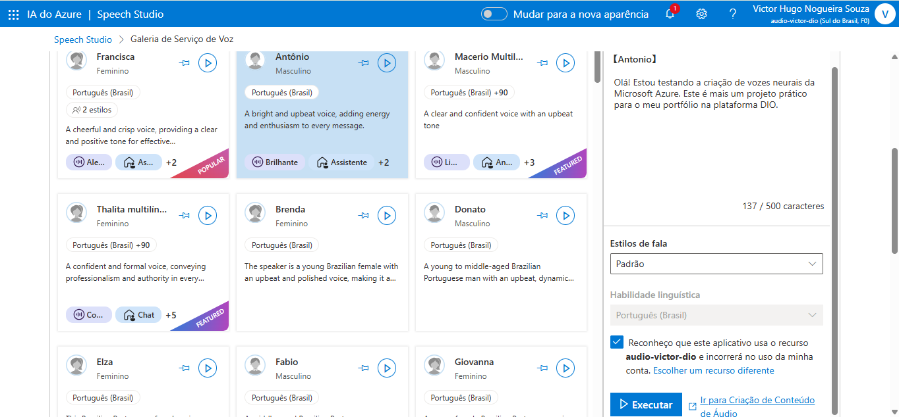

# ☁️ Laboratório: Serviços Cognitivos do Azure (Language & Speech)

Este repositório documenta as práticas de laboratório realizadas no **Azure Language Studio** e no **Azure Speech Studio**. O objetivo é aplicar conceitos de Inteligência Artificial em cenários reais, validando habilidades práticas para a certificação Microsoft Azure AI-900.

## 🎯 Objetivo do Projeto
Explorar e documentar a capacidade dos serviços de nuvem da Microsoft para extrair insights de textos não estruturados (NLP) e sintetizar áudios naturais a partir de texto (Text-to-Speech), ferramentas essenciais para a modernização da Análise de Dados e acessibilidade corporativa.

## 🛠️ Tecnologias Utilizadas
* **Microsoft Azure** (Camada Gratuita F0)
* **Azure AI Language:** Análise de Sentimentos e Mineração de Opiniões
* **Azure AI Speech:** Text-to-Speech com vozes neurais

---

## 📊 Parte 1: Análise de Sentimentos (Language Studio)

Nesta etapa, testei a ferramenta utilizando exemplos de frases positivas e negativas (simulando comentários de usuários) para observar como a Inteligência Artificial classificava os textos.

### 1. Cenário: Frase Mista
O teste mais relevante ocorreu ao submeter uma frase com polaridades opostas:
> *"O novo dashboard interativo melhorou muito a visualização das métricas, mas a lentidão na atualização do banco de dados na nuvem está gerando reclamações da equipe."*

**💡 Insight Analítico:** Apesar da sentença iniciar com um elogio, o algoritmo classificou o documento como **100% negativo**. Em sistemas de BI, isso é ideal: a ferramenta prioriza a "dor" do usuário (lentidão, reclamações) que exige ação imediata.

| Resultado da Análise Mista | Texto Original e Mapeamento |
| :---: | :---: |
|  |  |

---

### 2. Cenário: Frase Positiva
> *"A nova estrutura de Data Warehousing melhorou muito a velocidade das nossas consultas SQL. A equipe está extremamente satisfeita com o desempenho e a organização das métricas."*

O modelo respondeu com alta precisão (95% de confiança), identificando a satisfação com a infraestrutura.

| Resultado da Análise Positiva | Texto Original e Mapeamento |
| :---: | :---: |
|  |  |

---

### 3. Cenário: Frase Negativa (Contexto Informal)
> *"Meu time do CartolaFC foi péssimo na última rodada, a pontuação me deixou muito frustrado."*

A IA classificou corretamente como **100% negativo**, demonstrando eficácia em captar sentimentos em contextos de redes sociais e lazer.

| Resultado da Análise Negativa |
| :---: |
|  |

---

## 🗣️ Parte 2: Sintetização de Voz (Speech Studio)

O segundo laboratório focou na geração de áudio natural utilizando a voz neural brasileira (**Antônio**). O texto simulou uma apresentação de projeto.

**▶️ Demonstração em Vídeo do Resultado:**

  <video src="https://github.com/user-attachments/assets/8512224c-243f-4669-972b-639c5e4cdab2" controls="controls" width="100%">
    Seu navegador não suporta a tag de vídeo.
  </video>
   
  <em>(Vídeo demonstrativo da síntese de voz neural da Azure)</em>

 
 

**Configuração do Ambiente no Speech Studio:**

| Interface de Configuração |
| :---: |
|  |

---

  <em>Documentação criada como requisito prático do Bootcamp - Análise de Dados da DIO.</em>

